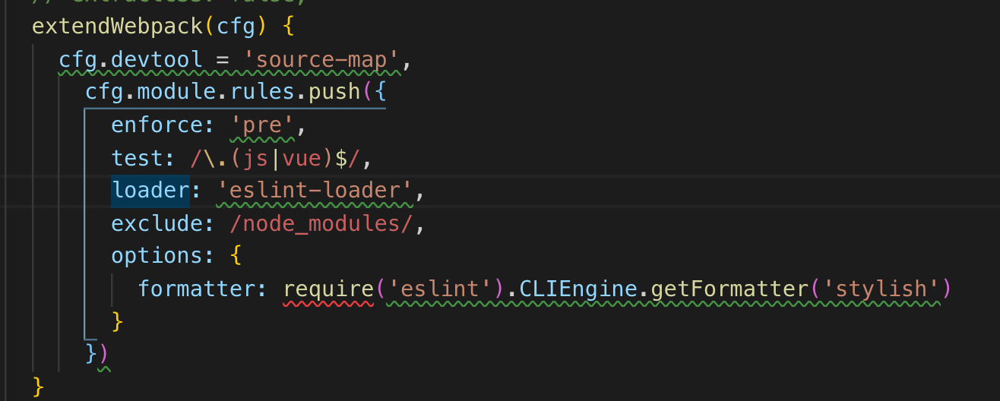
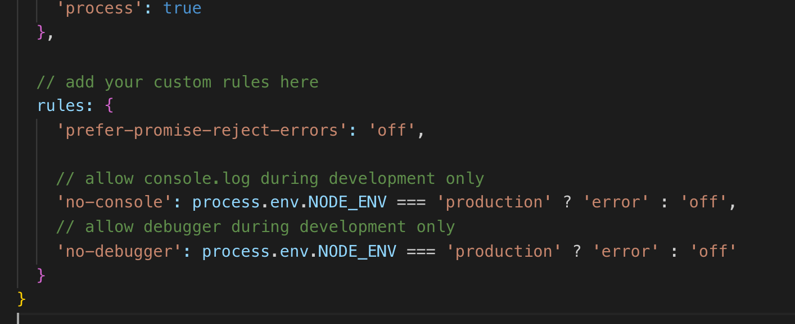
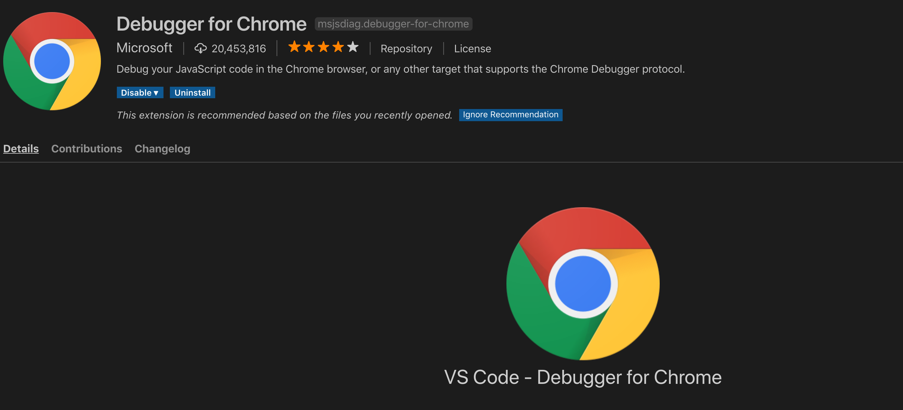

>**Depuração** (em [inglês](https://pt.wikipedia.org/wiki/Língua_inglesa): *debugging*, *debug* ) é o processo de encontrar e reduzir [defeitos](https://pt.wikipedia.org/wiki/Defeito_de_software) num [aplicativo de software](https://pt.wikipedia.org/wiki/Software) ou mesmo em [hardware](https://pt.wikipedia.org/wiki/Hardware). Erros de software incluem aqueles que previnem o programa de ser executado e aqueles que produzem um resultado inesperado.


### Debug em aplicações Vue.js

As aplicações JS atualmente, principalmente as que são feitas para serem executadas no lado do cliente (Browser Apps), precisam ser empacotadas em arquivos .js, .html e .css. Há várias formas manuais de se realizar tal façanha, mas a grande maioria dos desenvolvedores utiliza a ferramenta Webpack.

>**Webpack** (stylised **webpack**) is an [open-source](https://en.wikipedia.org/wiki/Open-source_software) [JavaScript](https://en.wikipedia.org/wiki/JavaScript) module bundler.[[2\]](https://en.wikipedia.org/wiki/Webpack#cite_note-2)[[3\]](https://en.wikipedia.org/wiki/Webpack#cite_note-3)[[4\]](https://en.wikipedia.org/wiki/Webpack#cite_note-4)[[5\]](https://en.wikipedia.org/wiki/Webpack#cite_note-5)[[6\]](https://en.wikipedia.org/wiki/Webpack#cite_note-6) It is a module bundler primarily for JavaScript, but it can transform front-end assets like HTML, CSS, and images if the corresponding plugins are included.[[7\]](https://en.wikipedia.org/wiki/Webpack#cite_note-7) Webpack takes modules with dependencies and generates static assets representing those modules.[[8\]](https://en.wikipedia.org/wiki/Webpack#cite_note-8)
>
>Webpack takes the dependencies and generates a dependency graph allowing web developers to use a modular approach for their web application development purposes. It can be used from the command line, or can be configured using a config file which is named *webpack.config.js*.[[9\]](https://en.wikipedia.org/wiki/Webpack#cite_note-9) This file is used to define loaders, plugins, etc., for a project. (Webpack is highly extensible via loaders which allow developers to write custom tasks that they want to perform when bundling files together.) A tool named [createapp.dev](https://createapp.dev/webpack/) simplifies the process of creating this config file.

O webpack é responsável por montar uma árvore de dependências, resolver problemas de caminho, montar a pasta de assets e resolver referências. Tudo isso em uma só biblioteca. E por isso é utilizada no Quasar.

Dentro do arquivo `quasar.conf.js` podemos ver que toda a configuração utilizada fica disponível para modificações/adições: 



Como o webpack é fundamentalmente uma ferramenta modular, é possível adicionar uma série de verificações e requisitos através desse JSON de configuração.

Por exemplo, podemos especificar um `loader`, que no caso é o `eslint-loader`, que sempre faz verificações do seu código JS antes de ser executado pelo browser, checkagens que são especificadas pelas regras no arquivo `.eslintrc.js`:



Ok, mas qual o motivo de aprendermos um pouco sobre isso? Bom, como a grande maioria das aplicações em JS utiliza um Loader também durate no desenvolvimento, teremos que utilizá-lo se quisermos fazer o debug de nossa aplicação.

#### Começando

Para esta parte, podemos utilizar o código dos projetos anteriores desenvolvidos durante os módulos passados. Vamos começar instalando a extensão do VSCode chamada Debugger for Chrome:




Ao instalá-la, um arquivo de configurações do debugger deve ser aberto automaticamente. Lá você pode ver o seguinte objeto:

```json
 {
 	"type": "chrome",
 	"request": "launch",
 	"name": "Launch Chrome against localhost",
 	"url": "http://localhost:8080",
 	"webRoot": "${workspaceFolder}"
 }
```

Desta forma, precisamos adicionar uma linha de configuração para que haja o mapeamento dos arquivos .Vue para o debugger, através da linha:

```json
"sourceMaps": true
```

Ficando então da forma:

```json
 {
 	"type": "chrome",
 	"request": "launch",
 	"name": "Launch Chrome against localhost",
 	"url": "http://localhost:8080",
 	"webRoot": "${workspaceFolder}"
 }
```


Além disso, também temos que modificar a configuração do webpack no arquivo `quasar.conf.js`, da forma: 

```json
extendWebpack(cfg) {
        cfg.devtool = "source-map",
        ... Mais configurações ...
      }
```

Para que o webpack mantenha uma árvore de relação do arquivo fonte com o arquivo resultante do empacotamento.

Pronto, agora é só adicionar o comando `debugger` como no exemplo:

```js
debugger;
console.log("clicacko");
let arr = 32;
arr++;
console.log(arr);
```

E conseguiremos facilmente debugar a aplicação!

> Atualmente há um problema nos breakpoints do VSCode quando um module bundler como o webpack é utilizado, principalmente com muitas configurações como é o caso do Quasar, por isso a necessidade de utilizar o comando `breakpoint`.

